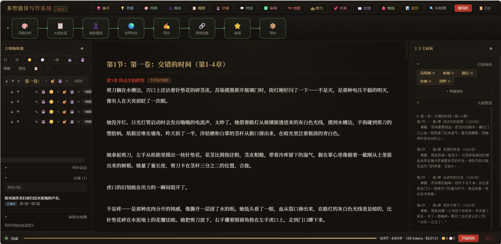
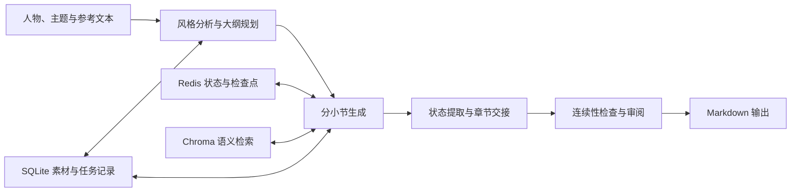

# 多智能体协作写作系统

一个面向长篇内容创作的多智能体写作实验项目。

系统将大纲规划、分段写作、一致性检查和审阅拆分为多个职责明确的组件，并通过结构化事件、章节交接、语义检索和检查点机制，为较长内容的连续生成提供上下文支持。

> [!IMPORTANT]
> 这是一个仍在迭代的个人项目，不是可直接替代作者或编辑的成品服务。生成质量取决于模型、素材、大纲和提示词，长篇输出仍需人工审阅。



_Web UI 同时展示写作阶段、大纲结构、生成正文和当前上下文。_

## 项目能做什么

- **规划与分段写作**：从人物设定、参考风格和故事梗概生成大纲，再按小节逐步写作。
- **多智能体协作**：由角色管理、风格分析、规划、写作、连续性编辑和审阅等组件分别处理不同阶段。
- **上下文管理**：结合运行摘要、章节交接笔记、人物状态和世界设定，为后续小节补充相关信息。
- **语义检索**：将已生成内容写入 Chroma，在继续写作时检索相关段落。
- **异步执行与恢复**：使用 Celery 和 Redis 执行长任务，保存阶段状态并提供检查点。
- **过程可见**：通过 Redis Stream 向 Web UI 增量传递生成内容和任务事件。
- **结构化素材管理**：提供人物、伏笔、规则、经历、物品、支线和故事地图等数据接口。

这些机制用于降低长篇生成中的上下文丢失风险，但不保证自动消除情节矛盾或人物偏移。

## 当前状态

- 当前版本：`0.9.0`
- 适用场景：本地实验、AI 写作流程研究、二次开发
- 默认 LLM：DeepSeek 的 OpenAI 兼容接口，可通过环境变量更换兼容服务和模型
- Embedding：Sentence Transformers、Ollama 或 OpenAI 兼容接口
- 主要界面：`http://localhost:8000/write-ui-v2`
- API 文档：`http://localhost:8000/docs`

## 工作流程



核心流程由 FastAPI 接收请求、Celery 执行任务，Redis 保存运行状态并传递事件。Chroma 保存文本向量，SQLite 保存人物、任务及其他结构化数据。

## 快速开始

### 前置条件

- Docker Desktop 或兼容的 Docker Compose 环境
- 一个可用的 OpenAI 兼容 LLM API
- 使用默认 Docker 配置时，需要在宿主机安装并启动 [Ollama](https://ollama.com/)

### 1. 克隆并配置

```bash
git clone https://github.com/Yang0407-loser/my_writing_system.git
cd my_writing_system
cp .env.example .env
```

编辑 `.env`，至少填写：

```dotenv
LLM_API_KEY=your_api_key
LLM_BASE_URL=https://api.deepseek.com/v1
LLM_MODEL=your_model_name
```

不要将真实 API Key 提交到仓库。

### 2. 准备 Embedding

Docker Compose 默认连接宿主机上的 Ollama：

```bash
ollama serve
ollama pull bge-m3:latest
```

如果不使用 Ollama，请在 `.env` 中配置其他 `EMBEDDING_PROVIDER`。可用选项和参数见 [.env.example](.env.example)。

### 3. 启动

```bash
docker compose up -d --build
```

服务就绪后打开：

- 写作界面：<http://localhost:8000/write-ui-v2>
- API 文档：<http://localhost:8000/docs>

查看运行状态：

```bash
docker compose ps
docker compose logs -f web worker-writing worker-general
```

停止服务：

```bash
docker compose down
```

首次构建需要下载镜像和依赖，耗时取决于网络与机器性能。

## 本地开发

需要 Python 3.11+、[uv](https://docs.astral.sh/uv/) 和 Redis。

```bash
uv sync --extra dev
cp .env.example .env
```

分别启动 Redis、Celery Worker 和 FastAPI：

```bash
uv run celery -A app.celery_app worker --loglevel=info -P solo -Q writing,celery
uv run uvicorn app.main:app --reload --host 0.0.0.0 --port 8000
```

## 测试

安装开发依赖后运行：

```bash
uv run pytest
```

运行覆盖率检查：

```bash
uv run pytest --cov=app --cov-report=term-missing
```

测试包含核心工具、数据模型、Agent 行为和部分工作流集成场景。涉及真实 LLM、Embedding 或 Redis 的端到端行为，仍会受到外部服务和本地环境影响。

## 主要目录

```text
app/
├── agents/          # 规划、写作、角色、风格和审阅组件
├── routers/         # FastAPI 路由
├── static/          # Web UI
├── writing/         # 写作上下文与章节交接逻辑
├── embedding/       # Embedding 提供商
├── coordinator.py   # 主流程编排
├── blackboard.py    # Redis 状态与事件
└── vector_store.py  # Chroma 向量存储

tests/
├── unit/
├── integration/
├── quality/
└── benchmarks/
```

## 已知限制

- 长篇生成会产生较多 LLM 调用，耗时和费用随大纲规模、模型与重试次数增长。
- RAG、摘要和交接笔记只能补充上下文，不能保证事实、伏笔或人物状态始终正确。
- Redis 中的检查点受持久化配置和数据保留策略影响；重要输出应单独备份。
- 不同 OpenAI 兼容服务对 JSON、流式输出和模型参数的支持可能不同。
- 启发式文本检查用于发现高频表达和模板化倾向，不应视为可靠的“AI 文本鉴定”。
- 当前 Web UI 和部分功能仍在调整，接口及数据结构可能发生变化。

## 文档

- [部署指南](DEPLOY.md)
- [调试指南](DEBUG.md)
- [开发进度](PROGRESS.md)
- [技术债记录](TECH_DEBT.md)
- 启动服务后的交互式 API 文档：`/docs`

## 参与开发

欢迎通过 Issue 提交 Bug、使用反馈或改进建议。提交 Pull Request 前，请先运行相关测试，并避免提交：

- `.env`、API Key 或其他凭据
- 本地数据库和 Chroma 数据目录
- 生成结果、日志及临时评测文件

## License

仓库当前尚未附带开源许可证。在正式添加 `LICENSE` 前，代码默认保留所有权利。
