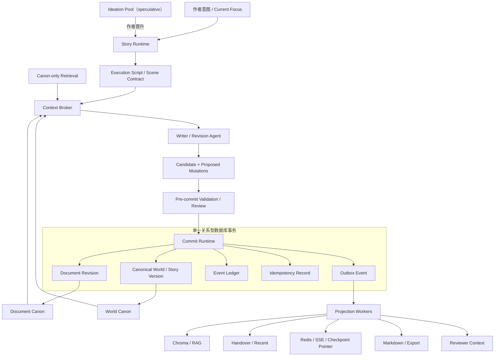
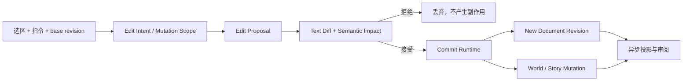
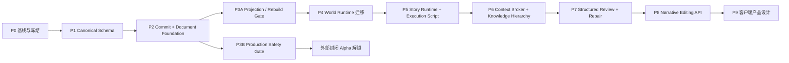

# Narrative OS：从服务端底层逻辑到客户端设计的总计划

> 日期：2026-08-09  
> 状态：建议执行版  
> 适用范围：`my_writing_system` 下一代架构与产品路线  
> 核心结论：先建立 Canon 与 Commit，再迁移 Runtime；最后让客户端成为这些底层能力的可视化操作面。

## 1. 执行摘要

项目下一阶段不再以“增加 Agent、增加 Prompt、增加一套状态表”为主线，而是把已经存在的 Writer、RAG、Handover、Context Broker、Reviewer、World Runtime 与前端统一成一套可持续演进的 Narrative Operating System。

总路线只有一条：

1. 先回答“什么才是正式正文、正式事实，以及一次正式提交如何成立”。
2. 再把 World Runtime 从实验资产迁入生产主链，并消除 Legacy 双权威。
3. 再建立 Story Runtime、Execution Script、Context Broker 和结构化审阅，让系统能在生成前约束、生成后诊断。
4. 再开放统一的 Narrative API，使 AI 与人工编辑都走 Proposal → Diff → Commit。
5. 最后设计客户端，把 Document、Patch、Review Issue、Context Trace 和 Runtime 状态转化为作者可理解的 Writing Block 体验。

目标产品不是“多 Agent 自动写小说”，而是：

> 一个以作品为中心、由 AI 与作者共同维护长期叙事一致性的 AI-native Novel IDE。

## 2. 路线选择

### 当前基线（2026-08-09 审计）

- 当前完整单元测试为 1452 passed、28 failed；集成测试为 54 passed、1 failed。失败集中在 Prompt contract、固定 hash 漂移、Writer 公共签名和本地 `.env` 污染 Legacy Handover 兼容测试。
- 当前 Writer 在正文正式提交前就可能更新 Handover、Legacy WorldState 和 EventGraph；`StateCommitter` 幂等记录只存在进程内存，自动回滚未启用。
- 完整正文分散在 Redis checkpoint、Markdown、Chroma 和 task history preview 中；task history 只保存前 2000 字，尚不能单独恢复作品。
- World Runtime 已有完整实验闭环，但生产 mode 尚未真正接入 Coordinator；WR4 sealed holdout 未过，读侧应保持关闭。已有 5/6 消费者接近 switch-ready，Reviewer 仍需 side-by-side 证据。
- 公网试用仍受鉴权/租户、明文 API Key checkpoint、CORS、Redis 暴露、跨 worker 限流、CI、备份恢复与可观测性缺口阻挡。
- 工作区存在大量未提交源码、测试与运行产物；P0 必须先保护和分类，不能通过清理命令误删用户资产。

### 方案 A：先做客户端 Writing Block

优点是产品体验最快可见，适合演示。缺点是当前没有 Canonical Document、稳定 Revision、原子提交和语义回写，客户端很快会反向逼迫服务端重做；AI 编辑还有覆盖用户修改、污染世界状态和版本不可恢复的风险。

结论：不采用为主线，仅允许在最后阶段前做不可连接生产数据的低保真交互验证。

### 方案 B：重写为全新的生产平台

优点是边界最干净，可以直接统一数据库、事件和前端技术栈。缺点是会放弃大量已验证的 Writer、World Runtime、Context、Handover 和评估资产，迁移风险高，容易形成长期不可交付的大工程。

结论：不采用。

### 方案 C：以 Canonical Store 和 Commit Runtime 为“绞杀者接缝”渐进迁移

在现有 Coordinator/Writer 主链中插入候选对象和唯一提交边界；先让旧消费者从 Outbox/Projection 获取数据，再逐步切换 World、Story、Context、Review 和客户端。实验模块只有在门禁通过后才获得生产权威。

结论：采用。它能保留现有成果，同时从根上解决状态权威和提交原子性问题。

## 3. 架构纲领

> Agent Runtime 只产生候选内容；Document Runtime 管理作者接受的文本事实；World Runtime 管理文本表达的世界事实；Story Runtime 管理作者意图与叙事计划；Commit Runtime 保证这些事实持久、幂等、可恢复地演进。Redis、Chroma、Handover、Recent、Reviewer Context 与导出文件都不得成为隐藏权威。

以下规则是仓库宪法级约束。任何新功能、实验迁移或客户端接口都必须先证明没有违反它们。

必须长期保持的十一条不变量：

1. Proposal 不等于 Canon，草稿、建议和推测不得进入正式检索与状态。
2. Writer、Reviewer 和编辑 Agent 都不能直接修改权威数据库。
3. 所有权威变化只能经过同一个 Commit Runtime。
4. 一次提交中的 Document Revision、Canonical State、Event Ledger、Idempotency Record 和 Outbox Event 必须在同一关系型数据库事务中成功或失败。
5. Chroma 是搜索投影，不是正文数据库；Redis 是运行态，不是小说事实库。
6. Handover、Recent 和 Writer Context 必须可由 Canon 重建。
7. Canonical Truth、Immutable Audit Evidence、Rebuildable Projection 三类数据必须分开。
8. 人工编辑拥有最高意图权威，但叙事性修改仍需显示影响并由作者确认同步策略。
9. World Runtime 的迁移允许 Shadow 双算，不允许长期双权威。
10. 客户端任何“接受修改”最终都只是一次带 base revision 的 Canonical Commit。
11. 每个阶段必须先扩展同一个 Golden Vertical Slice，再允许横向覆盖更多项目、章节或消费者。

## 4. 目标数据分类与所有权

| 数据类别 | 唯一所有者 | 典型内容 | 生命周期 |
|---|---|---|---|
| Canonical Document | Document Runtime | 作品、章、节、小节、Revision、正文快照 | 用户删除前永久保存 |
| Canonical Story | Story Runtime | Author Intent、Story Contract、Current Focus、故事线、角色弧、信息预算 | 版本化、可回滚 |
| Canonical World | World Runtime | 人物状态、关系、物品、地点、知识边界、已发生事件 | 版本化、可回放 |
| Event Ledger | Commit/World Runtime | 每次已确认事实变化及其正文证据 | 追加式、不可静默覆盖 |
| Audit Evidence | Observability | Prompt hash、StateFrame before/after、模型与检索 trace | 按审计保留策略保存 |
| Projection | Projection Workers | Handover、RAG metadata、Recent、Reviewer Context、Markdown | 可删除并重建 |
| Execution State | Agent Runtime / Redis | task、stage、progress、临时候选、审批等待、短期 checkpoint | 短期、可过期 |
| Speculative Space | Ideation Pool | 未采用灵感、AI 候选、讨论中的故事方向 | 永不自动进入 Canon |

## 5. 目标数据链



局部编辑必须复用同一条链：



## 6. 总体阶段与依赖



P0 → P1 → P2 → P3A 是锁定主线。后续研究可以改变 Execution Script、Issue 类型和客户端交互，但不得绕过这四个地基阶段。

整个范围按 30–40 个有效开发周作为粗略容量参考，不是日历承诺或发布日期。实际进度只由 Gate 是否通过决定，不用“第几周应该完成”倒逼跳过故障注入、恢复或迁移证据。多人参与时可以在 P2 后并行 P3A、P3B 与已解耦的研究任务，但并行不改变 Gate 依赖。

### Golden Vertical Slice 原则

P0 选择一个已经存在、内容可公开用于本项目测试的真实 project/chapter/subsection，冻结其输入、期望正文、初始状态和稳定标识。此后每个阶段先让同一个小节穿透新增链路：

| 阶段 | Golden Slice 必须新增的穿透能力 |
|---|---|
| P0 | 固化输入、Legacy 输出、测试基线和可恢复资产 |
| P1 | 能写入并读取最小 Canonical Schema |
| P2 | Generate → Candidate → Commit → Revision → Outbox |
| P3A | Outbox → Projection；删除投影后完整重建并对账 |
| P3B | 在真实身份/项目作用域内运行，备份后恢复 |
| P4 | Document → World Mutation Candidate → Canonical Commit |
| P5 | Author Intent → Execution Script → Writer → 同一 Commit |
| P6 | 生成确定性 Context Manifest，并解释每个输入来源 |
| P7 | Issue → Local Repair Proposal → Commit → Issue 重新定位/关闭 |
| P8 | 跨一个或多个稳定 Block 的 Edit Proposal → Diff → Accept → Commit |
| P9 | 用同一内容和状态完成端到端 UX 可用性任务 |

Golden Slice 通过只证明链路闭环，不证明全量生产就绪；每个阶段仍需在 Slice 通过后完成该阶段自己的覆盖、并发和故障门禁。

### 贯穿式 UX Spike：Design Early, Build Late

正式客户端实现仍放在 P9，但从 P5 开始允许使用假数据、静态 HTML 或设计工具做不连接生产的 UX Spike：

- P5 验证 Author Intent、Current Focus 和 Execution Script 如何被作者理解与修改。
- P7 验证单/多 Issue、Issue 证据、局部修复、忽略和失效状态。
- P8 前验证 Proposal 数量、跨 Block selection、部分接受、Semantic Impact 返回时机，以及人工编辑后何时触发语义检测。
- P8 API contract 必须吸收这些验证结论；不能先由后端臆造协议，再让 P9 客户端被动适配。

UX Spike 不读写生产 Canon、不决定前端技术栈、不演化成平行客户端。正式构建仍需等 P8 contract freeze。

## 7. P0：冻结扩张，建立可信基线

容量参考：3–5 个有效工作日。

### 目标

停止新增 Agent 和实验性写作能力，先建立可重复的代码、数据与质量基线。

### 工作内容

- 记录并保护当前脏工作区；将运行产物、报告、数据库与源码分层，避免数万未跟踪文件继续掩盖真实改动。
- 对当前 28 个单元测试失败和 1 个集成测试失败逐项分类：真实回归、过期契约、固定 hash 漂移、环境污染。
- 目标是“零未解释失败”：过期测试可以经记录后更新或删除，真实回归必须修复。
- 固化现有生产主链、World Runtime canary、WR4 holdout、Context Broker 与 Reviewer 的版本和结果。
- 绘制 Writer 所有读写副作用清单，并标为 Canonical、Audit、Projection 或 Cache。
- 冻结外部 API 当前行为，建立 contract snapshot，避免底层迁移无意破坏现有页面。

### 退出门槛

- 单元、集成和关键 contract 测试无未解释失败。
- 本地 `.env` 不再污染测试进程；测试明确控制 Handover/World Runtime contract version。
- 源码、测试、实验产物和运行数据有明确 Git/保留策略。
- 形成当前数据所有权和副作用矩阵。

### 本阶段不做

- 不接入客户端新功能。
- 不把 WR4 retrieval 打开。
- 不让 World Runtime 获得生产写权威。

## 8. P1：Canonical Schema 与数据生命周期

容量参考：1–2 个有效开发周。

### 目标

建立能回答“作者当前认可的正文是什么、正文意味着什么、何时发生了变化”的统一关系型数据模型。

### Schema v0 最小领域模型

Schema v0 优先表达 ownership、revision、transaction boundary 和 recovery，不负责完整表达 narrative ontology。P1 只建立：

- Project：包含最低限度的 owner/project scope 和显式 `current_state_version_id` World State Head；完整 Tenant 与 membership 在 P3B 建设。
- Document：作品根对象。
- Subsection：Golden Slice 所需的最小稳定正文单元；Chapter/Section 首版可以作为引用元数据，不急于独立正规化。
- Document Revision：完整正文快照、content hash、parent revision、status、creator、created_at。
- Canonical State Version：与 revision/commit 关联的版本化 blob/document，首版不拆 Character、Relationship、Item、Location、Timeline、Arc、Foreshadow 或 KnowledgeState 表。
- Canonical Commit：一次原子演进的唯一 ID。
- Event Ledger：追加式记录已确认事件、变化和正文证据。
- Idempotency Record：稳定 commit key 与已返回结果。
- Outbox Event：待投影的持久事件。

Audit Artifact 在 P1 只保留 commit/revision 关联位和最小 metadata；Prompt、StateFrame 与检索明细的独立保留策略在 P3B 建设，避免 P1 顺势演化成完整可观测平台。

### 数据设计决策

- 权威表使用同一个关系型数据库；生产目标为 Postgres，本地可保留 SQLite 适配，但事务语义必须由 Postgres 集成测试验证。
- Revision 首版保存完整快照，而不是只依赖 patch 回放；存储成本换取恢复确定性。
- Block 和 Patch 在 P8 扩展；P1 先确保未来可从 Subsection/Revision 平滑增加稳定 block ID。
- 所有表从开始就带 tenant_id/project_id，所有读取默认带作用域。
- Subsection Revision Head 与 Project State Head 都必须使用数据库约束防止跨 scope 指针；不得通过最后 commit 或 `created_at` 推断当前状态。
- Schema 迁移必须版本化，不再依赖运行时隐式建表。
- 未被 Golden Slice、原子提交或恢复测试直接消费的 Narrative Ontology 表不得进入 Schema v0。

### 退出门槛

- 只依赖 Canonical DB 可以恢复完整作品与当前 World State。
- Redis、Chroma、Markdown 和 output 目录全部不可用时，正文仍完整。
- 每种数据都定义创建者、更新者、删除者、归档策略和重建方式。
- 备份文件在全新环境成功恢复并通过内容 hash 对账。

## 9. P2：Commit Runtime 与 Document Runtime Foundation

容量参考：2–3 个有效开发周。

### 目标

把当前“状态副作用先发生、正文后提交”的链路改成 Candidate → Validate → Atomic Commit → Async Projection。

这是项目的 MVP-0。它的完成标准不是出现新页面，而是同一 Golden Slice 在 worker、Redis、Chroma 故障和重复重试下仍不会发生正文/状态分叉。

### 工作内容

- 定义 SubsectionCandidate：正文、Handover candidate、World mutation candidate、events、StateFrame、generation metadata，以及生成时读取的 `base_revision_number` 与 `base_state_version_id`。
- Writer 只返回 Candidate，不再直接更新 EventGraph、WorldState、Handover、Chroma、Recent 或 Stream。
- P2 过渡期由 Legacy 适配器把现有 Handover/WorldState/EventGraph 语义转换成 World mutation candidate；它可以提供候选解释，但不能绕过 Commit Runtime 写状态。P4 替换的是事实解释与验证引擎，不再改动提交边界。
- 在 Commit 前通过纯 `StateTransition` 边界把 base state + mutations 编译成完整 next-state snapshot；P2 使用 opaque Legacy adapter，Commit Service 只持久化准备好的 Canon 对象，不解释 Narrative Ontology。
- 新增统一 Commit Service，在单一事务内写入 Document Revision、Canonical State、Event Ledger、Idempotency Record 和 Outbox。
- Commit 同时锁定并校验 Subsection Revision Head 与 Project State Head；任一过期都显式冲突。
- 稳定 commit key；并发首次请求由数据库 unique reservation 冲突协议收敛，Celery retry 在调用 LLM 前先查询既有 idempotency result；多 worker 并发与 worker 重启都只能得到原提交结果，不能产生重复事件。
- P2 期间 Writer 仍读取的 Legacy World/Event、Handover/Context 与 Chroma 属于 critical projections；它们未追到当前 commit 前必须暂停下一小节生成。Stream、preview、Markdown 与 analytics 为 non-blocking projections。
- 将正文内容从 task preview / Markdown 迁移到 Canonical Document Repository；历史任务只保留执行元数据与文档引用。
- 在过渡期提供 Legacy Adapter，让旧页面和 Coordinator 仍可读取，但不得绕过 Commit Service 写权威数据。

### 故障注入验收

- 在正文、状态、ledger、idempotency、outbox 任一事务步骤失败时，权威表零部分写入。
- SQL commit 成功后，即使 Chroma、Redis、Handover 或导出失败，Canon 仍成立，投影可重试。
- 同一 commit 消息重复 100 次，只产生一个 revision 和一组 ledger 记录。
- worker 在事务前、事务中、事务后分别终止，恢复后结果一致。
- 任何失败都可从 commit_id 追踪，不再依赖进程内 `_committed` 字典。

### 退出门槛

- 新生成小节全部通过 Commit Runtime。
- 旧副作用顺序被切断或封装为 post-commit projection。
- Critical Projection Barrier 未 ready 时不会开始下一小节；commit-after-crash 的 Celery retry 不重新调用 LLM。
- 自动恢复演练通过，且没有 Canon/Document 分叉。

## 10. P3：Projection、恢复与生产保障

容量参考：P3A 与 P3B 各 1–2 个有效开发周，可在边界稳定后并行推进。

### 目标

P3 保留一个总编号，但内部是两个独立 Gate。P3A 解锁 P4 Narrative Runtime 演进；P3B 解锁外部用户试用。P4 不需要等待所有 SaaS 安全工程完成。

### Gate A：Projection + Rebuild

目标是证明 Canon → Outbox → Projection → Rebuild 不产生隐藏权威。

#### Projection 工作

- Outbox dispatcher 使用持久 cursor 与 consumer idempotency。
- 建立 Chroma、Handover、Recent、Redis/SSE、Markdown Export、Reviewer Context 的独立 projector。
- 每个投影暴露 committed revision、projected revision、lag、last error 与 retry count。
- 提供按 project/revision 重建投影的管理命令和校验报告。
- 修复 Redis Stream 删除 key 不一致，并建立任务/项目删除审计。

#### Gate A 退出门槛

- 任何一个 Projection 可删除后重建并与 Canon hash 对账。
- Outbox 重放不产生重复投影副作用。
- Redis 重启和 Chroma 故障不影响 Canon 成立；恢复后 projection lag 归零。
- Golden Slice 完成删除全部派生数据后的重建演练。

Gate A 通过后可进入 P4；无需等待 Gate B 完成。

### Gate B：Production Safety

目标是补齐外部用户试用所需的身份、数据边界、密钥、CI、备份和运维保障。

#### 安全与隔离

- 增加用户鉴权、project membership 与 API 作用域检查。
- checkpoint 只保存 provider/credential reference，不保存明文 API Key。
- Redis 不对公网暴露；启用认证、持久化和适合 checkpoint 的淘汰策略。
- CORS 使用白名单，不再 wildcard + credentials。
- 限流从进程级升级为按 tenant/user/provider 的分布式限流。

#### 可观测与交付

- 统一 request_id、task_id、commit_id、revision_id 和 projection event id。
- 记录阶段耗时、token、模型成本、重试、fallback、projection lag、状态 diff 与 hard-rule divergence。
- 建立 CI：unit、integration、schema migration、contract、fault injection smoke。
- 建立 readiness、备份、恢复、告警和数据保留 runbook。

#### Gate B 退出门槛

- 无明文密钥进入 Redis、日志、task history 或 Audit Artifact。
- 两个 worker 的租户隔离、权限拒绝与分布式限流场景通过。
- Canonical DB 备份在全新环境恢复，并通过 document hash 与 ledger 对账。
- CI、readiness、告警和恢复 runbook 均经过一次真实演练。
- 只有 Gate B 完成，才允许邀请外部封闭测试用户；Gate B 不阻塞 P4–P8 的内部开发。

## 11. P4：World Runtime 生产迁移

容量参考：2–4 个有效开发周。

### 目标

把现有 World Runtime 的 Constitution → Resolve → Compile → Extract → Validate → Commit → Projection 闭环真正接入主链，并在验证后淘汰 Legacy 双权威。

### 模式状态机

| 模式 | Legacy | World Runtime | 对 Writer 的影响 | 写权威 |
|---|---|---|---|---|
| off | 正常读写 | 不运行 | 无 | Legacy 过渡态 |
| shadow | 正常读写 | 完整双算、记录 diff | 无 | Legacy 过渡态 |
| canary | 仍可回退 | 指定项目/小节的投影供真实消费者读取 | 有限 | Canonical Store |
| authoritative | 只做兼容投影或关闭 | 唯一生产链 | 全量 | World Runtime Canon |

配置项必须真正控制 Coordinator、Writer、Reviewer 和 projector 行为，而不是只通过配置校验。

### 迁移顺序

1. 持久化 World Runtime repository 与 commit idempotency。
2. 将 typed extraction/validation 输出改为 Candidate，不直接提交。
3. 接入 Commit Runtime 的同一事务。
4. Shadow 对比 Legacy 与 World Runtime，所有 hard-fact divergence 必须有解释。
5. 依次迁移 Handover、RAG metadata、Checkpoint、Character/Relationship、Reviewer 六类消费者。
6. Canary 只开放给可回滚的项目与小节。
7. Authoritative 后停止 Legacy 写入；保留短期只读兼容投影，随后删除重复职责。

### 退出门槛

- 模式切换、回退和重放均有自动测试。
- Canary 样本中零未解释 hard-fact divergence、零重复 ledger event、零 Canon 分叉。
- Reviewer side-by-side 达到约定门槛；WR4 retrieval 在 sealed holdout 未通过前继续关闭。
- Authoritative 切换后不存在 Legacy 与 World Runtime 同时写同一事实。

## 12. P5：Story Runtime、Author Control 与 Execution Script

容量参考：2–3 个有效开发周。

### 目标

从“这一节发生什么”升级为“为什么写、怎么发生、哪些信息必须展示或隐藏”。

### Canonical Story 内容

- Author Intent：作品长期承诺、核心命题、不可漂移方向。
- Story Contract：故事线、角色弧、主题承诺、禁止漂移。
- Current Focus：当前卷/章的最高优先级叙事目标与情绪方向。
- Ideation Pool：所有 speculative 候选，只有作者 promote 后才能进入 Story Canon。
- Execution Script：scene function、protagonist goal、opposition、agency、emotional turn、tension、information budget、foreshadowing、ending hook、prohibited outcomes。

### 数据链

Author Intent + Current Focus + Outline + Arc + Narrative Events → Story Compiler → Execution Script → Context Broker → Writer。

本阶段同步启动第一轮 UX Spike，只用 Golden Slice 的假数据验证作者如何查看、修改和确认 Author Intent、Current Focus 与 Execution Script。Spike 结论作为 P8 API 输入，不接入生产 Canon。

### 退出门槛

- speculative idea 无法被 Canon-only retrieval 或 Writer hard context 意外召回。
- 每个生成小节都能追溯到明确 Execution Script 版本。
- Writer 可自由实现文风，但不能违反 hard contract；Reviewer 能指出违反了哪条 contract。
- Story Runtime 与 World Runtime 职责不重叠：前者管叙事意图，后者管世界事实。
- UX Spike 对 Story Contract 的对象边界和确认动作没有发现必须推翻的数据契约问题；如发现，先修正 contract 再进入 P8，不用客户端兼容错误抽象。

## 13. P6：Context Broker 与分层知识体系

容量参考：1–2 个有效开发周。

### 目标

把当前 Writer 内部的多来源拼接，收敛为唯一的上下文决策层。

### 上下文优先级

1. P0：Execution Contract、Author Intent、Current Focus、用户当前指令。
2. P1：当前 Canonical World/Character State、受保护事实、当前 Document/Scene。
3. P2：目标前后 Blocks、最近 Canon 正文。
4. P3：Canon-only RAG Evidence。
5. P4：可压缩长期 Memory、Reference Material、Style Evidence。

每个 Context Item 必须携带 authority、relevance、freshness、compressibility、token estimate、source revision 与选择理由。

### Policy-first 决策链

Context Broker 必须是确定性策略优先、LLM 可选，而不是第二个超级 Agent：

authority gate → scope gate → retrieval → ranking → budget allocation → compression。

- Execution Contract、Author Intent、Current Focus 和当前 Canonical World 属于 mandatory context，由策略直接选入。
- 只有 RAG evidence 进入 relevance ranking；只有可压缩 memory/reference/style 允许模型辅助摘要。
- LLM 不得决定是否丢弃 hard contract、覆盖 authority rank 或把 speculative 内容晋升为 Canon context。
- 相同 Canon revision、instruction 与 policy version 必须生成可重放的 Context Manifest；LLM 压缩结果作为带来源的派生项记录。

### 检索分层

- Canon Knowledge、World State、Story State、Document Memory、Reference Material、Style Evidence 分开建模。
- 相关性不能覆盖权威性；当前 Canon State 永远高于旧正文或参考素材。
- 默认检索只读取当前 Canon revision scope；draft、rejected、superseded 和 speculative 不进入正式上下文。
- 局部表层编辑默认只使用 Target + Local；只有语义需求明确时才升级 Scene/Global retrieval。

### 退出门槛

- Writer 不再自行无序 concat 多个 Store。
- token 超预算时按可压缩性与权威级别渐进压缩，P0 内容不得被截断。
- 每次生成能解释“用了什么、为何使用、被什么替代或丢弃”。
- Golden Slice 的 mandatory context 在多次运行中选择结果稳定；LLM 关闭时仍能生成合法 Context Manifest。
- Context Broker 的离线/Shadow 评估过门禁后再替换 Legacy 组装。

## 14. P7：Structured Review 与 Contract-based Repair

容量参考：2 个有效开发周。

### 目标

把 Reviewer 从任务结束后的评分报告改成锚定正文、可确认、可修复的 Narrative Linter。

### Review Issue 契约

每个 Issue 至少包含 issue_id、origin_revision、origin_block/paragraph anchor、current_anchor、type、severity、evidence、diagnosis、violated contract、revision scope、revision goal、preserve invariants、status 与 superseded_by。

Issue 状态为 open、accepted、ignored、fixed、stale、superseded；Reviewer 只能创建 Issue，不能直接修改 Canon。

每次新 Revision 后运行 Issue reconciliation：证据仍存在则重定位 current_anchor；违反条件消失则 fixed；无法可靠重定位则 stale；被更精确的新诊断替代则通过 superseded_by 串联。系统不得把“找不到旧段落”静默等同于问题已修复。

本阶段用假数据开展第二轮 UX Spike，验证多 Issue、证据展开、局部修复、忽略、stale 和 superseded 状态；结论进入 P8 Issue API。

### Repair 流程

Plan Contract → Generate → Measure Deviation → Issue List → Local Proposal → Re-evaluate → Human/Policy Commit。

- 默认局部修复，不整节重新生成。
- 每次修复明确保留事实和禁止修改范围。
- 自动循环有严格上限；超过上限转人工决策。
- Pre-commit Review 只阻断硬规则与明显一致性错误；Post-commit Review 形成可处理 Issue。

### 退出门槛

- Issue 能稳定锚定 Revision/Block，不因后续插入段落整体漂移。
- Golden Slice 经一次人工编辑和一次 AI repair 后，旧 Issue 能确定地重定位、关闭、失效或被替代，不存在无状态遗失。
- 修复不改变 preserve invariants，且可通过 patch 回滚。
- 不再出现 Reviewer 给分后 Writer 无范围重写整节的默认流程。

## 15. P8：Narrative Editing API 与客户端就绪层

容量参考：2–3 个有效开发周。

### 目标

在不先建设新客户端的前提下，完成 Writing Block 所需的稳定服务端接口与并发语义。

进入接口冻结前，必须先用 UX Spike 对以下问题作出明确决策：Proposal 是单候选还是候选集、selection 是否允许跨 Block、是否支持部分接受、Semantic Impact 与文本 Proposal 同步还是异步返回、人工编辑后的语义检测采用显式触发还是延迟触发。决定必须写入 API contract，不能留给客户端猜测。

### Document 扩展

- 稳定 Block ID；支持 paragraph、dialogue、heading、separator 等最小 block type。
- Current materialized blocks + immutable revision snapshot + patch log。
- Patch 原语只保留 create、update、delete、move；润色、扩写、精简、重写只是上层 Edit Intent。
- 支持 block/scene/document 三个查看与回滚粒度，但所有回滚本质上生成新 revision，不篡改历史。

### Edit Proposal

- 请求包含 document、target blocks/selection、instruction、operation、semantic permission、base revision。
- Surface Mutation 默认只允许语言、节奏、句式和描写变化，禁止改变事件、人物、物品、关系、时间和空间事实。
- Semantic Mutation 先生成 Text Diff、Semantic Diff、Impact Analysis 与 Story/World Patch，待作者接受。
- base revision 与 current revision 不一致时返回显式冲突，不允许 AI 静默覆盖作者刚完成的编辑。
- 接受 Proposal 必须走 Commit Runtime；拒绝 Proposal 不留下正式副作用。

### API 能力清单

- 作品结构与 Canon revision 查询。
- 手工 patch 与自动保存。
- AI edit proposal 创建、流式进度、查看、接受、拒绝。
- revision timeline、diff、undo/redo。
- structured review issue 查询、忽略、请求修复。
- semantic impact 确认与投影状态查询。
- Context Trace/Provenance 的授权读取。

### 退出门槛

- API contract 在 P9 正式高保真设计和客户端技术 ADR 开始前冻结一个版本；更早的 UX Spike 专门用于促成这次冻结。
- 并发编辑、重复接受、超时重试、过期 proposal 和 revision conflict 全部有测试。
- 用户可以只通过 API 完成“打开作品 → 修改 → AI 建议 → 接受 → 回滚 → 检查状态影响”的完整闭环。

## 16. P9：客户端产品设计收尾

容量参考：2–3 个有效开发周；本阶段汇总此前 UX Spike，完成正式设计与可用性验证，再单独立项实现。

### 产品心智

客户端不是任务控制台，也不是聊天窗口外加 Markdown 预览。中心对象必须是持续存在、可人工编辑、可版本化的 Novel Document。Chat 降级为控制面；AI 的结果体现为 Document 上的 Proposal、Patch、Issue 和 Trace。

P9 不从零开始思考交互。P5/P7/P8 的 UX Spike 已经验证对象与协议，本阶段负责统一信息架构、异常状态、高保真体验和客户端技术 ADR；正式代码仍在设计验收后另行实施。

### 信息架构

```text
┌──────────────────┬──────────────────────────────────┬────────────────────┐
│ Story / Project  │ Canonical Writing Block          │ AI / Context       │
│                  │                                  │                    │
│ 卷章场景树        │ 正文、选区、inline diff           │ 对话 / 编辑意图      │
│ 角色/世界/伏笔    │ Review Issue、Locks、版本状态     │ Context Inspector   │
│ Ideation Pool    │ Commit / Projection 状态         │ Impact Analysis    │
└──────────────────┴──────────────────────────────────┴────────────────────┘
```

### 核心交互

1. 选中正文后出现润色、重写、扩写、精简、对白、节奏、去 AI 味、审阅与自定义菜单。
2. AI 永不直接覆盖：先显示 before/after 与 word-level/block-level diff，再接受或拒绝。
3. 语义修改显示 World/Story 影响，并提供“同步状态”“调整后续计划”“仅作为表层文字”的明确选择；高风险选择需二次确认。
4. 人工直接编辑自动形成 revision；检测到叙事变化时创建 reconciliation proposal，不阻断正常写作。
5. Review Issue 以内联红线/侧栏诊断呈现，可查看证据、请求局部修复、忽略或确认新规则。
6. Context Inspector 回答“为什么这样写”，展示实际使用的 Contract、角色状态、事件、伏笔、RAG、Style 与 source revision。
7. Locks 分为 Text Lock、Plot Lock、Canon Lock；AI proposal 必须尊重锁定范围。
8. Revision Timeline 支持 block/scene/document 对比与恢复；恢复生成新 revision。
9. Ideation Pool 与 Canon 区域视觉分离，任何晋升都展示差异和影响。
10. 显示 document committed / world committed / rag pending 等后台状态，但使用作者可理解的语言，不暴露内部微服务术语。

### 关键页面与状态

- Project Home：作品、最近编辑、生成/投影异常、恢复入口。
- Writing Workspace：三栏主界面与全屏专注模式。
- Story Inspector：Author Intent、Current Focus、Execution Script、角色/事件/伏笔。
- Review Center：跨章 Issue、严重度、处理状态与批量筛选。
- Revision & Recovery：版本时间线、diff、恢复、导出。
- Settings & Data：模型凭据引用、数据导出、删除、备份状态。

必须设计 idle、manual editing、generating proposal、proposal ready、commit pending、projection lag、revision conflict、offline、partial failure 和 recovery complete 等状态，不能只设计 happy path。

### 设计交付物

- 用户旅程与对象模型图。
- 完整信息架构和页面状态矩阵。
- 低保真主流程原型。
- Writing Block、Diff、Impact、Review Issue、Context Inspector、Lock、Revision Timeline 的高保真关键态。
- 键盘操作、无障碍、中文长文本排版与 10 万字级性能约束。
- 至少 5 名目标作者的任务式可用性测试报告。
- 客户端技术选型 ADR：继续现有静态页面、引入独立 Web Client、编辑器内核与状态同步方式；此决策在 API contract 冻结后做，不在底层阶段提前绑定。

### 设计验收

- 作者能在不理解 Runtime、Projection、Outbox 等术语的情况下完成核心闭环。
- 5 名测试者中至少 4 名能独立完成“局部 AI 修改 → 读懂影响 → 接受 → 撤销”。
- 没有任何常规操作会让用户误以为 AI proposal 已自动成为 Canon。
- 冲突、投影延迟和恢复状态有明确反馈，不以无限 loading 掩盖失败。

## 17. 用户开放节奏

### 内部 Dogfood

P2 完成后开放，只验证 Canonical Document、Commit、恢复和基本生成；不承诺 World Runtime authoritative 或高级编辑。

### 封闭 Alpha

P3B 和 P4 canary 完成后开放给少量受邀作者。必须具备鉴权、租户隔离、完整正文备份、操作审计和人工恢复能力。

### 产品 Alpha

P8 完成且 P9 设计验证后，实施客户端最小闭环：手工编辑、选区 Proposal、Diff、接受/拒绝、Undo、Review Issue。

### 公测

只有在恢复演练、权限测试、并发冲突、投影重建和真实长篇数据性能全部过门禁后才考虑。自动无人值守生成几十万字不属于首个公测目标。

## 18. 横向验收指标

### 正确性

- Canon 部分写入：0。
- 重复提交造成重复 revision/event：0。
- 未解释 hard-fact divergence：0。
- 被拒绝/过期 proposal 进入 Canon/RAG：0。
- 明文密钥进入持久状态或日志：0。

### 恢复性

- 仅凭 Canonical DB 恢复完整作品成功率：100%。
- Chroma/Handover/Recent/Export 可重建率：100%。
- 每次备份恢复均通过 document hash 与 ledger replay 对账。

### 质量与控制

- 每个小节具备可追溯 Execution Script 与 Context Manifest。
- Reviewer Issue 具备正文证据与修复范围，而非只有总分。
- 局部修复保留指定 invariants，越界率进入持续门禁。

### 产品体验

- Proposal 接受、拒绝、撤销都有确定结果。
- 客户端不会丢失人工编辑或被迟到的 AI 响应静默覆盖。
- 用户能区分表层编辑、叙事编辑、候选与 Canon。

## 19. 风险与停止条件

| 风险 | 处理方式 | 停止条件 |
|---|---|---|
| Canon schema 过度设计 | 首版围绕 subsection revision + world state + ledger，Block 延后扩展 | 如果为未来 UI 引入当前无消费者的复杂 CRDT/图数据库，停止并缩 scope |
| 把 Outbox 做成分布式事务 | SQL 内只提交 Canon + Outbox，所有外部系统异步 | 如果提交成功依赖 Chroma/Redis/Markdown 同时成功，停止 |
| World Runtime 长期双写 | Shadow 只双算，authoritative 后关闭 Legacy 写 | 如果不能明确唯一权威与退出日期，不进入 authoritative |
| Reviewer 再次变成 Writer | Issue 与 Proposal 分离，修复必须显式发起 | 如果 Reviewer 自动覆盖正文，停止 |
| Context Broker 一次替换全部输入 | 先 Shadow manifest，再逐消费者切换 | 如果没有 source-level 对比和回退，停止切换 |
| 客户端提前绑定脆弱 API | P8 contract freeze 后再做高保真和技术选型 | 如果仍用 task output 代替 document revision，暂停客户端实现 |
| 实验持续膨胀 | 每个实验有晋级、收口、归档三种结论 | sealed holdout 未过不得以 Demo 数量替代证据 |

## 20. 首个两周执行包

这是总计划批准后的第一批工作，不同时启动后续 Runtime 或客户端：

### 第 1 周

- 完成 P0：测试失败归因、环境隔离、运行产物治理、Writer 副作用矩阵。
- 写出 Canonical Truth / Audit / Projection / Cache 的逐表所有权清单。
- 定义 Canonical Commit、SubsectionCandidate、Document Revision、Event Ledger 和 Outbox 的 v0 contract。
- 写 ADR：关系型数据库边界、生产 Postgres/本地 SQLite 策略、迁移与回滚。

### 第 2 周

- 先用测试建立原子提交、幂等重放、外部投影失败和 worker crash 四类失败契约。
- 实现最小 Canonical Document Repository 与 Commit Service vertical slice。
- 只迁移一个小节生成路径；旧链保留显式 feature flag 回退。
- 进行首次恢复演练：删除临时 Redis/Chroma 投影后，从 Canon 重建并对账。

### 两周结束的决策点

只有以下条件同时成立才进入 P2 全量迁移：

- 一个真实小节通过 Candidate → Transaction → Outbox → Projection 全链。
- 重复任务、worker crash 和 Chroma failure 不造成 Canon 分叉。
- Canonical DB 可单独恢复正文。
- 旧接口仍通过 contract test，且回退开关有效。

## 21. 后续计划拆分规则

本文件是跨子系统主计划，不直接作为一次性开发清单执行。进入每个阶段前，必须单独形成该阶段实施计划，包含准确文件、测试、迁移脚本、回滚命令和验证数据。推荐拆分为：

1. Canonical Store + Commit Runtime 实施计划。
2. P3A Projection / Rebuild 实施计划。
3. P3B Production Safety 实施计划。
4. World Runtime Production Migration 实施计划。
5. Story Runtime + Execution Script 实施计划。
6. Context Broker Production Cutover 实施计划。
7. Structured Review + Targeted Repair 实施计划。
8. Narrative Editing API 实施计划。
9. Client UX/Product Design brief 与后续客户端实现计划。

所有子计划都必须以本文件的不变量、阶段门禁和唯一权威模型为上位约束。
