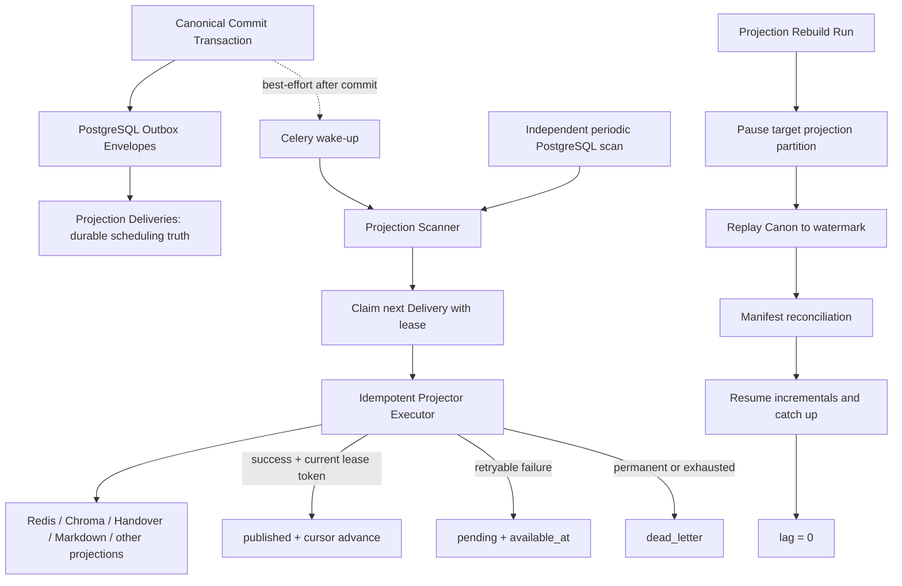

# P3A Projection / Rebuild 架构设计

> 日期：2026-08-10
> 基线：`narrative-os-foundation-v1` / `dfd0edb`
> 分支：`feat/p3a-projection-rebuild`
> 状态：设计已逐项批准，等待书面复核
> 前置成果：P0/P1/P2 Foundation Gate 已通过

## 1. 阶段目标

P3A 只证明一个核心命题：

> 所有 Projection 都不是权威；删除任一 Projection 后，仅凭 Canon 可以确定性重建，并在失败、重试、并发和恢复后重新追到当前 Canon Head。

P3A 将 P2 的同步、单进程最小 Outbox Dispatcher 升级为可恢复的投影基础设施，但不建设通用任务平台，也不承担外部生产可用性目标。

P3A 完成后，系统必须同时成立：

1. Canonical Commit 的成立不依赖任何 Projection、Redis、Celery、Chroma 或文件系统。
2. 投影调度事实只存在于 PostgreSQL。
3. Celery/Redis 的消息丢失、重复、乱序或长期不可用不会永久丢失投影工作。
4. Projection Worker 可以多实例运行，同一作品/Projector 内仍保持严格顺序。
5. 投影执行是 at-least-once；语义效果通过确定性标识和幂等写入做到 effectively-once。
6. 任一 Projection 可以在受控维护窗口内删除、重建、校验并恢复增量消费。
7. Canon 与 Projection 的差异能够被持续检测，但 Projection 永远不能反向修改 Canon。

## 2. P3A 宪法级不变量

### 2.1 唯一调度权威

**Projection scheduling truth lives exclusively in PostgreSQL. Celery/Redis may reduce scheduling latency, but loss, duplication, reordering, or prolonged unavailability of Celery messages must not cause projection loss, duplicate semantic effects, or prevent eventual recovery.**

中文版：

**投影调度事实只存在于 PostgreSQL。Celery/Redis 仅用于降低调度延迟；消息丢失、重复、乱序或长时间不可用，不得导致投影工作永久丢失、产生重复语义副作用或阻止最终恢复。**

### 2.2 Canon 与 Projection 的权限边界

- Canonical Commit 一旦提交即成立。
- Projection 成功、失败、滞后、维护或死信都不能回滚 Canon。
- Reconciliation 只能报告、阻塞 Projection readiness 或触发重建，不能修订 Canon。
- Projection Barrier 表示兼容投影是否可读，不表示 Canon 是否 committed。

### 2.3 Lease 与完成语义

- Lease 只表示临时处理权，不表示处理成功。
- `published` 才是持久化完成状态。
- Worker 在外部写入成功、数据库确认前崩溃时，Delivery 会在 Lease 过期后再次执行。
- 所有 Projector 必须能够安全承受重复执行。
- 只有持有当前 `lease_token` 的 Worker 才能确认成功、失败或续租；过期 Worker 不能覆盖新 Worker 的结果。

### 2.4 有序并发

**P3A 不支持同一 `(tenant_id, project_id, projector_id)` 投影流内乱序并行。**

- 同一投影流只处理最早的未完成 Delivery。
- 多 Worker 并发发生在不同作品或不同 Projector 之间。
- Cursor 不允许跳过 pending、processing 或 dead-letter 空洞。
- Dead-letter 只阻塞对应 Projector/作品分区，不阻塞 Canon、其他 Projector 或其他作品。

## 3. 已选方案与拒绝方案

### 3.1 调度模型

选择：**PostgreSQL Outbox + Lease 为 correctness；Celery 为 best-effort wake-up；独立 PostgreSQL scanner 为恢复路径。**

拒绝：

- Celery 消息为唯一工作事实：会重新形成 PostgreSQL/Celery 双权威。
- 只使用 PostgreSQL polling：正确但没有必要放弃现有 Celery 的低延迟唤醒能力。
- Celery task 直接无条件处理指定事件：重复、过期消息可能绕过数据库所有权判断。

PostgreSQL 官方将 `SKIP LOCKED` 明确列为多个消费者访问 queue-like table 时避免锁竞争的适用场景：<https://www.postgresql.org/docs/current/sql-select.html>。

Celery 官方说明 late acknowledgement 下任务可能因 Worker 崩溃而重复执行，因此任务必须幂等：<https://docs.celeryq.dev/en/stable/userguide/tasks.html>。

### 3.2 Rebuild 模型

选择：**projection-scoped maintenance rebuild。**

拒绝：在线影子 Generation、双投影、读指针和原子切换。这些能力只有真实外部可用性 SLA 证明维护式重建不可接受时才单独立项；不属于 P3A Gate，也不在 P3A 开展预研实验。

### 3.3 增量与重建工作模型

选择：

- 增量工作由 `projection_deliveries` 逐条持久化。
- 重建由 `projection_rebuild_runs` 保存运行阶段、Lease、Watermark 和 checkpoint cursor。
- Rebuild 不生成逐事件 `rebuild_items`，不建设第二套任务队列。
- 增量与重建复用同一 Projector executor 和幂等契约，但不混用运行状态。

### 3.4 现有 Outbox 粒度

P2 当前每次 Canon commit 已经原子创建七条 `outbox_events`，每条定向一个 Projector。P3A 保留该结构：

```text
Canonical Commit
├── Outbox Envelope: legacy_world_event
│   └── Delivery: legacy_world_event
├── Outbox Envelope: handover_context
│   └── Delivery: handover_context
├── Outbox Envelope: chroma_story_chunks
│   └── Delivery: chroma_story_chunks
├── Outbox Envelope: redis_stream
│   └── Delivery: redis_stream
├── Outbox Envelope: task_preview
│   └── Delivery: task_preview
├── Outbox Envelope: markdown_export
│   └── Delivery: markdown_export
└── Outbox Envelope: analytics
    └── Delivery: analytics
```

`outbox_events` 的 Canon 引用、路由、事件类型和 payload 构成不可变投影信封；`projection_deliveries` 承载可变调度状态。

P3A 不把它规范化为“一条 Outbox Event + 七条 Delivery”，因为该变更不会提高 Lease、Rebuild 或恢复正确性，却会扩大历史 ID、幂等结果和迁移范围。Outbox Fan-out 规范化列入 Deferred Schema Cleanup。

新增 Projector 不为历史 Commit 补造 Outbox Envelope。历史状态由 `projection_rebuild_runs` 直接从 Canon 重建至 Watermark；Reconciliation 通过并完成原子启用后，只有启用位置之后的新 Commit 才为该 Projector 创建 Envelope + Delivery。

## 4. 总体组件



### 4.1 Projector Registry

代码中的唯一 Projector Registry 保存：

- 稳定 `projector_id`
- `projector_version`
- `barrier_kind`: `critical | non_blocking`
- Lease TTL 与 heartbeat 策略
- `max_attempts`、backoff 和错误分类策略
- Projector executor
- clear adapter
- expected/actual manifest adapter

P3A 保留 P2 的七个 Projector：

- Critical：`legacy_world_event`、`handover_context`、`chroma_story_chunks`
- Non-blocking：`redis_stream`、`task_preview`、`markdown_export`、`analytics`

新增 Projector 不是运行时隐式行为。Projector 代码注册只表示系统具备该投影能力，不表示它已经对某个作品启用。启用必须经过显式 bootstrap rebuild、reconciliation 和 activation；禁止为历史 Commit backfill Outbox Envelope 或 Delivery。

#### 4.1.1 新 Projector 启用状态机

```text
registered / disabled
  → bootstrapping
  → reconciled_to_initial_watermark
  → activated_for_new_commits
  → catching_up_activation_gap
  → active / current
```

- `registered / disabled`：代码中存在 Projector，但 Canonical Commit 不为它创建 Envelope。
- `bootstrapping`：`projection_rebuild_runs` 从 Canon 重建历史状态，不依赖历史 Envelope/Delivery。
- `activated_for_new_commits`：在项目行锁保护的 PostgreSQL 事务中记录 `activation_position`；从该 position 开始的新 Commit 才创建 Envelope + Delivery。
- `catching_up_activation_gap`：初始 Watermark 与 activation 前 Canon Head 之间的提交仍由同一个 Rebuild Run 直接从 Canon 补齐，不补造 Envelope。
- `active / current`：activation gap 已 reconciliation，随后由正常 Delivery 增量消费维持 current。

代码 Registry 定义能力和策略；PostgreSQL 中每个作品/Projector 的 enrollment 状态决定 commit-time fan-out。两者缺一都不能创建新 Envelope。

### 4.2 Projection Scanner

Scanner 是纯 PostgreSQL 消费者，提供同一套 `scan_once()` 核心路径：

- 独立常驻进程按固定 cadence 调用，是 Celery/Redis 全部不可用时的恢复路径。
- Celery wake-up 调用同一 `scan_once()`，只降低延迟。
- 运维 CLI 可调用同一路径进行 bounded drain。

Celery task 只能表达“数据库里可能有工作”，例如：

```text
wake_projection_scanner(projector_id?, project_id?)
```

参数是扫描提示，不是处理授权。Scanner 必须重新查询 PostgreSQL、取得 Lease 并确认当前状态。禁止提供绕过 claim 的 `project_this_event(event_id)` 执行路径。

### 4.3 Projector Executor

Executor 接收不可变 Projection Message 和当前 Delivery Lease Context，执行：

1. 校验 Canon commit 仍为 committed 且作用域匹配。
2. 校验 Delivery、Projector version、分区维护状态和 Lease token。
3. 获取投影分区共享维护锁并再次校验分区未暂停。
4. 使用确定性 ID 执行幂等写入。
5. 生成 Projection Receipt。
6. 使用当前 Lease token 条件更新 Delivery。
7. 成功时推进连续 Cursor；失败时按分类重试或进入 Dead-letter。

外部写入和 PostgreSQL 完成确认不能组成跨系统事务，因此 P3A 明确采用 at-least-once 执行与幂等语义，而不宣称跨系统 exactly-once。

## 5. 数据模型

字段名称可在实施计划中按现有 SQLAlchemy/Alembic 约定微调，但语义不得改变。

### 5.1 Canon Stream Position

每个 Canonical Project 维护单调递增的 `stream_position`：

- Canonical Commit 在持有项目行锁的原子事务中取得下一个 position。
- 同一 commit 为当时已启用 Projector 创建的 Outbox Envelope 共享同一 position；P3A 基线为七个。
- 唯一性为 `(project_id, stream_position)`。
- position 只用于项目内顺序、Watermark、Cursor 和 lag，不承担跨项目全局时间顺序。
- 回滚事务产生间隙是允许的；算法不依赖 position 连续，只依赖严格递增。

### 5.2 `projection_deliveries`

一条 Outbox Envelope 对应一条 Delivery。

核心字段：

| 字段 | 语义 |
|---|---|
| `id` | Delivery ID |
| `outbox_event_id` | 不可变 Outbox Envelope FK |
| `tenant_id/project_id` | 强制作用域隔离 |
| `projector_id/projector_version` | 稳定消费者身份与执行版本 |
| `barrier_kind` | critical / non_blocking |
| `stream_position` | 作品内严格顺序 |
| `status` | pending / processing / published / dead_letter |
| `available_at` | 下一次允许 claim 的时间 |
| `leased_by` | Worker 实例 ID |
| `leased_until` | Lease 到期时间 |
| `lease_token` | 每次 claim 生成的新 fencing token |
| `attempt_count` | 总尝试次数 |
| `last_attempt_at` | 最近尝试时间 |
| `last_error_code/class/message` | 最近错误摘要 |
| `published_at` | 持久完成时间 |
| `receipt_json/receipt_digest` | 本次投影的确定性收据 |

约束：

- 唯一 `(outbox_event_id, projector_id)`。
- 唯一 `(tenant_id, project_id, projector_id, stream_position)`。
- `processing` 必须具有完整 Lease 字段。
- `published` 必须具有 `published_at` 和 receipt。
- `pending` 不得保留有效 Lease。
- `dead_letter` 不会被普通 Scanner 自动 claim。

### 5.3 `projection_attempts`

追加式审计表，记录：

- claim 与 Lease token
- worker、触发来源（periodic scan / Celery wake-up / operator drain）
- started / succeeded / retry_scheduled / lease_expired / dead_lettered
- 错误分类、错误摘要和 backoff
- operator requeue 及操作者/原因
- rebuild supersede 关系

Delivery 行保留当前状态，Attempt 行保留不可覆盖的历史证据。Heartbeat 不逐次写审计事件，避免无意义放大；只更新当前 Lease。

### 5.4 `projection_partitions`

每个 `(tenant_id, project_id, projector_id)` 一行：

- `runtime_status`: active / pause_requested / maintenance / catching_up
- `last_published_position`
- `last_published_event_id`
- `active_rebuild_run_id`
- `projector_version`
- `enrollment_status`: disabled / bootstrapping / active
- `activation_position`: 第一个正常创建 Envelope + Delivery 的 Canon position
- 维护请求、恢复和健康时间戳

Partition Cursor 是进度与有序消费依据，不是内容权威。它只能在当前 Lease token 成功确认且不存在更早空洞时前移。

### 5.5 `projection_rebuild_runs`

核心字段：

- `id`
- `run_kind`: maintenance / projector_bootstrap
- target tenant/project/projector scope
- pinned `projector_version`
- `watermark_position`、对应 commit/revision/state version
- bootstrap 专用 `activation_head_position/activation_position`
- `status`
- `checkpoint_position`
- rebuild Lease：`leased_by/leased_until/lease_token`
- expected / processed record counts
- expected / actual manifest JSON 与 digest
- error、started/completed timestamps
- operator 与原因

状态机：

```text
requested
  → pausing
  → clearing
  → rebuilding
  → reconciling
  → catching_up
  → completed

任一阶段 → failed
reconciling → reconciliation_failed
```

运行中断后，由 Lease 过期恢复当前阶段。`projector_version` 变化时禁止静默续跑，必须使用原版本恢复或显式重新开始。

### 5.6 Projection Manifest / Reconciliation Evidence

统一 Manifest 至少包含：

- projector ID/version
- tenant/project scope
- watermark
- normalized record count
- content digest
- revision/commit coverage
- ledger digest（适用时）

控制表保存 expected/actual manifest、差异摘要和运行关联。Manifest 是验证证据，不是新的内容权威。

## 6. Incremental Delivery 数据链路

### 6.1 Commit 与唤醒

```text
Candidate validated
→ Canonical Commit transaction
→ Revision + State + Ledger
→ one immutable Outbox Envelope per active Projector (P3A baseline: 7)
→ one pending Projection Delivery per Envelope
→ commit PostgreSQL transaction
→ best-effort Celery wake-up
```

Outbox Envelope 和 Delivery 必须与 Canonical Commit 在同一 PostgreSQL 事务中创建。Commit Service 只为该作品中 `enrollment_status = active` 且当前 position 不早于 `activation_position` 的 Projector fan out。Celery publish 只能发生在数据库提交以后；发送失败只记录日志/指标，不能改变 commit 结果。

### 6.2 严格有序 Claim

Claim 使用单条 PostgreSQL 事务完成：

1. 只考虑 active Partition。
2. 对每个 Partition 只选择最早的未完成 Delivery。
3. 若最早记录为未过期 `processing` 或 `dead_letter`，该 Partition 暂不可 claim。
4. `pending AND available_at <= now()` 或 Lease 已过期的 `processing` 可被选中。
5. 使用 `FOR UPDATE SKIP LOCKED` 避免多 Worker 互相等待。
6. 原子写入新的 `leased_by/leased_until/lease_token`、递增 attempt，并返回 Delivery。

Claim 结果为空是正常状态，不构成错误。

### 6.3 完成、失败与 Crash Window

成功确认使用条件更新：

```text
WHERE delivery_id = :id
  AND status = 'processing'
  AND lease_token = :token
```

条件不匹配表示 Worker 已过期，只能丢弃本次确认，不能覆盖新所有者。

Crash Window：

| 崩溃点 | 恢复语义 |
|---|---|
| claim 后、外部写入前 | Lease 过期后重试 |
| 外部写入中 | 结果未知，Lease 过期后幂等重试 |
| 外部写入成功、DB 确认前 | 重复执行，确定性 ID/upsert 消除重复语义 |
| DB 标记 published 后 | Cursor 已连续推进，不再 claim |

长任务必须 heartbeat 续租。续租和最终确认都要求当前 Lease token。

### 6.4 Retry 与 Dead-letter

- Retryable：连接中断、超时、临时限流、目标服务暂时不可用。
- Permanent：payload/schema 不可解释、Projector 不存在或版本不兼容、确定性约束违反。
- 可重试失败回到 `pending`，设置指数 backoff 后的 `available_at`。
- 永久错误或重试耗尽进入 `dead_letter`。
- Dead-letter 不自动重投；必须显式、可审计地 operator requeue。
- Requeue 恢复为 pending，但保留所有 Attempt 历史。

Critical Dead-letter：

- Canon 保持 committed。
- 对应 Projection Barrier 不得宣称 current。
- 系统健康为 degraded / blocked_for_projection。

Non-blocking Dead-letter：

- 不阻塞 Canon 和 critical barrier。
- 健康状态 degraded，必须进入 lag、告警和运维证据。

## 7. Projection 幂等契约

每个 Projector 必须满足：相同 Canon 输入执行一次、两次或在 Worker 崩溃后再次执行，最终语义结果一致。

最低约束：

| Projector | 幂等策略 |
|---|---|
| `legacy_world_event` | 以 commit/ledger event 确定性键 upsert 或去重 |
| `handover_context` | 以 revision/subsection 确定性替换，不追加重复语义 |
| `chroma_story_chunks` | 延续 commit/revision/content hash 的确定性 chunk ID |
| `redis_stream` | 以 stream position 构造确定性事件 ID，严格顺序写入 |
| `task_preview` | 以 canonical task/commit identity upsert |
| `markdown_export` | 固定 canonical path，原子替换并校验 content hash |
| `analytics` | 以 canonical event identity 去重/upsert |

任何只能 append、不能去重或不能枚举验证的旧实现都不能直接通过 P3A Gate，必须先补齐 adapter 契约。

## 8. Projection-scoped Maintenance Rebuild

### 8.1 阶段流程

```text
1. pause target projection claims
2. drain existing in-flight writes
3. record Canon watermark = stream position + commit/revision/state refs
4. clear target projection
5. rebuild deterministically from Canon to watermark
6. reconcile hash / count / ledger / revision coverage
7. supersede deliveries <= watermark and advance cursor
8. resume incremental projection
9. catch up watermark → current Canon head
10. verify lag = 0
```

Canon 写入不暂停。Watermark 之后的 Canonical Commit 正常创建 Outbox Envelope 和 pending Delivery，在目标 Partition 恢复前等待。

### 8.2 安全暂停

仅把 Partition 标记为 paused 不足以排除“旧 Worker 在清空后迟到写入”。P3A 使用 PostgreSQL 维护锁形成明确边界：

1. Rebuild 持久写入 `pause_requested`，阻止新 claim。
2. 增量 Worker 在外部投影写入期间持有该 Partition 的共享 advisory lock，并在取得锁后再次检查暂停状态。
3. Rebuild 获取同一 Partition 的排他 advisory lock，等待现有共享持有者退出。
4. 取得排他锁并确认无有效 in-flight Delivery 后，Partition 进入 maintenance，才允许 clear/rebuild。
5. Rebuild Worker 崩溃时 advisory lock 自动释放，但 durable Partition 仍保持 maintenance；恢复 Worker 必须重新获取排他锁才能继续。

真实 PostgreSQL Gate 必须验证该锁边界；SQLite 只允许测试纯状态机，不作为并发正确性证据。

### 8.3 Canon Replay 与 Checkpoint

- Rebuild 从 Canonical Commit、Revision、State Version 和 Ledger 重建 Projection Message，不依赖旧 Projection 内容或 Delivery 成功状态。
- 按作品内 stream position 严格顺序扫描到固定 Watermark。
- 每个 batch 成功后提交 checkpoint。
- Worker 在外部写入后、checkpoint 前崩溃会重复当前 batch，因此仍依赖相同幂等 executor。
- 不创建逐事件 rebuild item。
- Rebuild 重复执行必须得到相同 Manifest。

### 8.4 Reconciliation 与恢复增量

每个 Projector 实现：

```text
expected_manifest = normalize(project_from_canon(scope, watermark))
actual_manifest   = normalize(read_projection(scope, watermark))
```

只有 count、content digest、coverage 和适用的 ledger digest 全部一致，Rebuild 才能从 `reconciling` 前进。

不一致时：

- 状态为 `reconciliation_failed`。
- Partition 保持 maintenance。
- 不修改 Canon。
- 不推进 live Cursor。
- 保存差异摘要供诊断和重新执行。

一致时，在 PostgreSQL 事务中：

- 将该 Partition 中 `stream_position <= watermark` 的未完成 Delivery 标记为由本次 Rebuild superseded/published。
- 写入对应 Attempt/Audit 证据。
- 将 Partition Cursor 前移至 Watermark。
- 恢复 active，释放维护锁。
- 普通 Scanner 处理 Watermark 之后的 pending Delivery。

只有追到当前 Canon Head 且 lag 为零，Rebuild Run 才标记 `completed`。

### 8.5 新 Projector Bootstrap 与原子启用

新 Projector 没有历史 Outbox Envelope，也不补造。其启用链路为：

```text
register capability, enrollment = disabled
→ create bootstrap rebuild run
→ record initial watermark W
→ rebuild Canon <= W
→ reconcile W
→ lock canonical project row and read current head H
→ atomically set enrollment = active, activation_position = H + 1
→ new commits at position >= H + 1 create Envelope + Delivery
→ replay Canon range W < position <= H directly through rebuild run
→ reconcile activation gap through H
→ release incremental claims from H + 1
→ catch up pending Deliveries to current head
→ current / lag = 0
```

`H + 1` 表示项目的下一个 stream position，不要求全局连续。原子 activation transaction 与 Canonical Commit 使用同一项目行锁，因此不存在某个 Commit 既落在历史 Rebuild 之外、又没有获得新 Envelope 的窗口。

如果 activation 后 gap reconciliation 失败：

- 新 Commit 仍可继续生成 Envelope + Delivery，但该 Partition 保持不可读/不可 claim 的 catching-up 状态。
- Rebuild Run 从 Canon 恢复并重新 reconciliation；不能通过补造历史 Envelope 修复。
- 只有 gap reconciliation 成功后才开放正常 Scanner claim 并宣称 Projector current。

因此需要区分“已启用 commit-time fan-out”和“Projection 已 current”：前者封住 Envelope 起点，后者必须等待历史 bootstrap、activation gap 和新增 Delivery 全部追平。

## 9. Projection Barrier、Lag 与健康状态

Critical Barrier 从 Delivery/Partition 读取，不再把 Celery 状态或旧 Outbox 状态作为权威。

某 commit 的 critical projection 为 ready 必须同时满足：

- 三个 critical Delivery 均为 published；
- 对应 Partition 为 active；
- Cursor 已覆盖该 commit 的 stream position；
- 没有覆盖该 position 的 reconciliation failure。

建议指标：

- `projection_lag_events`
- `projection_lag_seconds`
- `projection_oldest_pending_age`
- `projection_processing_count`
- `projection_expired_lease_count`
- `projection_dead_letter_count`
- `projection_retry_count`
- `projection_rebuild_status`
- `projection_reconciliation_mismatch_count`
- `projection_wakeup_failure_count`

Lag 以数据库中未完成记录和 Canon Head/Cursor 计算；不依赖 Celery queue length。

## 10. 迁移与兼容策略

P3A 使用 expand → backfill → cutover → verify，避免一次迁移同时改变所有语义。

### 10.1 Expand

- 添加 project/commit/outbox stream position。
- 创建 Deliveries、Attempts、Partitions、Rebuild Runs 和 Reconciliation evidence 表。
- 保留 P2 `outbox_events` 的现有字段和 ID。

### 10.2 Backfill

- 按 Canon 项目内状态/提交链确定已有 commit 顺序并填充 stream position。
- 只为已经存在的 P2 Outbox Envelope 创建一条 Delivery；这属于 P2→P3A 状态拆分，不得为任何新增 Projector 或缺失的历史 Commit 补造 Envelope。
- `published` 映射为 published 并生成迁移 receipt。
- `pending` 映射为 pending。
- `failed` 映射为 pending，保留 attempts/error 后安全重试。
- `processing` 映射为 pending；在无法证明旧 Worker 所有权时宁可幂等重放。
- 创建 Partition Cursor，只推进到每个 Projector/作品连续 published 的最大 position，不跨越空洞。

### 10.3 Cutover

- Canonical Commit 只为该作品中已启用的 Projector 同事务创建 Envelope + Delivery。
- 新 Scanner 只查询 Delivery。
- 旧同步 Dispatcher 必须关闭，禁止新旧消费者同时运行。
- Celery wake-up 切换为 scanner hint。
- Barrier 切换到 Delivery/Partition。

P3A 期间可保留旧 Outbox `status/attempts/...` 为明确标记的 deprecated compatibility mirror，以支持短期应用回滚；它们不是调度权威。所有 Envelope 内容字段保持不可变。后续独立 Contract Migration 再删除旧状态列。

### 10.4 Verify 与回滚

- Cutover 后运行真实 PostgreSQL Foundation smoke、并发 claim、Celery outage 和单 Projector rebuild。
- 若 Cutover Gate 失败：先停止新 Scanner，再回滚应用；不得让 P2 Dispatcher 与 P3A Scanner 并行。
- 数据库 expand migration 默认保留，避免破坏已写入的 Delivery/Attempt 证据。
- 兼容 mirror 允许 P2 代码在明确停掉 P3A Worker 后短期恢复。
- Rebuild clear 属于目标 Projection 的破坏性操作，执行前必须验证 scope、Watermark 和备份/可重建条件；Canon 数据不得进入清理范围。

## 11. P3A Gate

以下 Gate 必须在真实 PostgreSQL 上通过；SQLite 结果不能替代 PostgreSQL 并发证据。

### 11.1 Lease 与并发

- 多 Worker 同时扫描时，同一 Delivery 只有一个有效 Lease owner。
- 不同作品/Projector 可并行，同一 Projector/作品严格按 stream position 执行。
- Lease 过期可被重新 claim；旧 token 不能确认或覆盖新结果。
- 长任务 heartbeat 正常续租，失去 token 后立即停止确认。

### 11.2 Wake-up 降级

- 同一 wake-up 重复 50 次，不产生重复语义效果。
- Celery wake-up 丢失时，独立 scanner 最终完成 Delivery。
- 停止 Redis/Celery 后连续产生 Canon commits，随后仅恢复 PostgreSQL scanner、不重发任何旧 Celery 消息，所有 Projection 最终追到当前 Canon revision。

### 11.3 Crash Window 与幂等

- claim 后崩溃。
- 外部写入前/中崩溃。
- 外部写入成功、DB 确认前崩溃。
- DB 确认后收到旧 Celery 消息。
- 每种情况最终都无永久丢失、无重复语义效果。

### 11.4 Retry、Dead-letter 与 Barrier

- Retryable error 按策略 backoff。
- Permanent/exhausted error 进入 durable Dead-letter。
- Dead-letter 不被普通 scanner 自动重投。
- Operator requeue 有完整审计并能恢复处理。
- Critical Dead-letter 阻塞 readiness 但不否定 Canon。
- Non-blocking Dead-letter 不阻塞 critical barrier，但健康状态 degraded。

### 11.5 Rebuild

对七个 Projector 分别证明：

1. 目标 Projection 可完全删除。
2. 固定 Watermark 后可从 Canon 确定性重建。
3. 重复 Rebuild 不产生重复语义。
4. Rebuild 中断后能安全恢复或重新开始。
5. Canon 在 Rebuild 期间继续提交，Watermark 后 Delivery 不丢失。
6. Redis/Chroma 重启不破坏最终结果。
7. 注入漏建、重复或内容篡改时 Reconciliation 必须失败。
8. Reconciliation 成功后能够恢复增量并最终 lag = 0。

新增 Projector 还必须证明：

- 历史 Commit 的 Outbox Envelope/Delivery 数量在 bootstrap 前后不增加。
- Projector 能从 Canon 重建至 initial Watermark。
- activation transaction 能确定唯一 `activation_position`。
- initial Watermark 与 activation Head 之间的 gap 只通过 Canon replay 补齐。
- `activation_position` 之后的新 Commit 全部且仅创建一个 Envelope + Delivery。
- gap reconciliation 失败时不开放正常 claim、不宣称 current，恢复后最终 lag = 0。

### 11.6 回归与证据

- P0/P1/P2 Foundation 全量回归保持通过。
- Golden Slice 继续使用真实 PostgreSQL Canon 链路。
- Ruff、diff check、secret scan 全绿。
- 生成机器可读 P3A Gate evidence，包含数据库后端、Projector/version、Watermark、失败注入、Manifest digest、最终 lag 和测试命令。

## 12. 明确不属于 P3A

- Online Generation Rebuild / Shadow Projection / Atomic Read Cutover。
- 双写、读指针、旧 Generation GC、跨存储蓝绿切换。
- 外部可用性 SLA 和零停机 Projection Rebuild。
- Auth、Tenant hardening、Credential references、分布式限流、备份、生产 CI、生产 Runbook；这些属于 P3B。
- World Runtime 成为权威解释层；这属于 P4，且被 P3A Gate 阻塞。
- 通用工作流引擎、Kafka 或另一个消息权威。
- 同一 Projector/作品分区内的乱序并行优化。
- 跨 PostgreSQL 与外部 Projection 的 exactly-once 事务声明。
- Outbox Fan-out 规范化；列入 Deferred Schema Cleanup。

## 13. 完成定义

P3A 只有同时满足以下条件才完成：

- PostgreSQL 是 Projection 工作、Lease、Retry、Dead-letter、Cursor、Rebuild 和 Reconciliation 状态的唯一权威。
- Celery/Redis 可完全停用而不丢工作，恢复只依赖 PostgreSQL scanner。
- 七个 Projector 都具有已验证的幂等执行与 Manifest adapter。
- 七个 Projection 都通过删除、重建、中断恢复、差异注入和增量追赶 Gate。
- 所有 Partition 最终 lag = 0，Critical Barrier current。
- Foundation 回归、PostgreSQL Gate、静态检查和安全扫描全部通过。
- Gate evidence 与已知 deferred work 写入项目架构事实文档。

满足这些条件后，P3A 才解锁 P4。它仍然不等价于 external production ready；外部 Alpha 继续受 P3B 阻塞。

## 14. 自审清单

- [x] PostgreSQL 是唯一调度权威，Celery 只是可选加速器。
- [x] Celery/Redis 全停恢复 Gate 有独立 PostgreSQL scanner，不依赖 Celery Beat。
- [x] Lease、过期重领、stale token 和外部写入 crash window 已定义。
- [x] 同一作品/Projector 有序，跨作品/Projector 并行。
- [x] Delivery、Attempt、Partition、Rebuild Run 和 Manifest 的职责不重叠。
- [x] Rebuild 不创建第二套逐事件队列。
- [x] Canon 在 Rebuild 期间可继续提交。
- [x] Reconciliation failure 不修改 Canon，也不错误恢复 Projection readiness。
- [x] Critical/non-blocking Dead-letter 语义与 Foundation Barrier 一致。
- [x] 现有 P2 Outbox Envelope 粒度被保留，没有无收益的 Fan-out 迁移。
- [x] 新增 Projector 不回填历史 Envelope/Delivery，通过 Canon bootstrap rebuild 后从原子 activation position 开始 fan-out。
- [x] 在线影子 Rebuild 明确 Deferred 且不开展实验。
- [x] P3B、P4 与 P3A 的阶段边界明确。
- [x] 不宣称跨系统 exactly-once。
- [x] 没有未决 TBD/TODO。
